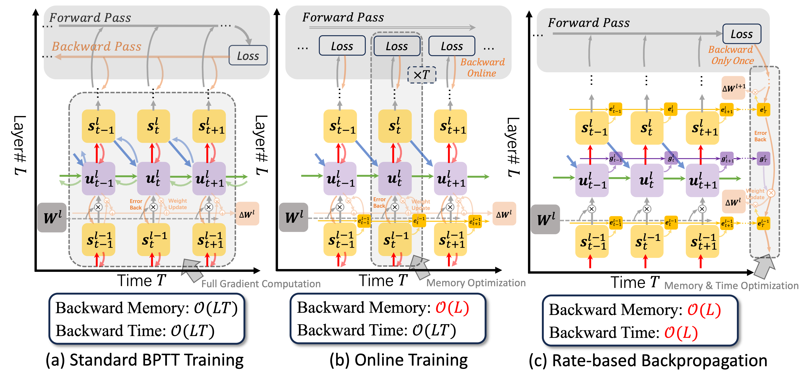

# Rate-based Backpropagation

This repository hosts the code implementation of the rate-based backpropagation detailed in paper, "**Advancing Training
Efficiency of Deep Spiking Neural Networks through Rate-based Backpropagation**", accepted at NeurIPS 2024. [[arXiv](https://arxiv.org/abs/2410.11488)][[OpenReview](https://openreview.net/forum?id=wlcm21C4nk)]




## Dependencies

```
# Name                 Version
python                  3.9.19 
torch                   2.3.1
torchvision             0.18.1
tensorboard             2.17.0
spikingjelly            0.0.0.0.14
```

## Directory Tree

```
.
├── experiment
│   ├── cifar
│   │   ├── config
│   │   └── main.py
│   └── dvs
│       ├── config
│       └── main.py
├── model
│   ├── layer.py
│   ├── resnet.py
│   └── vgg.py
└── util
    ├── data.py
    ├── image_augment.py
    ├── misc.py
    └── util.py

```

The experiment code for datasets are located on corresponding directories in experiment (CIFAR-10/CIFAR-100 in `experiment/cifar`, CIFAR10-DVS in `experiment/dvs`).
Code related to neurons is defined in `model/layer.py`; code related to batch normalization is defined in `util/util.py`.
The computational graph using rate-based gradients is implemented via model hooks, which are encapsulated in `util/util.py`.

## Usage

1. __Reproducing BPTT Results__. To reproduce the results using backpropagation-through-time (BPTT) within the current project framework, use the following commands:
    ```bash
    ##### BPTT with multi-step #####
    # for CIFAR-10/100
    python experiment/cifar/main.py --dataset CIFAR10 --data_path [data_path] --arch resnet18 --T 4 --step_mode m
    # for CIFAR10-DVS
    python experiment/dvs/main.py --dataset CIFAR10_DVS_Aug --data_path [data_path] --arch vggsnn_dvs --step_mode m

    ##### BPTT with single-step #####
    # for CIFAR-10/100
    python experiment/cifar/main.py --dataset CIFAR10 --data_path [data_path] --arch resnet18 --T 4 --step_mode s
    # for CIFAR10-DVS
    python experiment/dvs/main.py --dataset CIFAR10_DVS_Aug --data_path [data_path] --arch vggsnn_dvs --step_mode s
    ```

2. __Using Rate-Based Backpropagation__. To enable rate-based backpropagation as a replacement for BPTT, use the following commands:

    ```bash
    ##### Rate-BP with multi-step #####
    # for CIFAR-10/100
    python experiment/cifar/main.py --dataset CIFAR10 --data_path [data_path] --arch resnet18 --T 4 --step_mode m --rate_flag
    # for CIFAR10-DVS
    python experiment/dvs/main.py --dataset CIFAR10_DVS_Aug --data_path [data_path] --arch vggsnn_dvs --step_mode m --rate_flag

    ##### Rate-BP with single-step #####
    # for CIFAR-10/100
    python experiment/cifar/main.py --dataset CIFAR10 --data_path [data_path] --arch resnet18 --T 4 --step_mode s --rate_flag
    # for CIFAR10-DVS
    python experiment/dvs/main.py --dataset CIFAR10_DVS_Aug --data_path [data_path] --arch vggsnn_dvs --step_mode s --rate_flag
    ```

3. Options for Hyper-Parameters:
    - `--arch`: corresponding SNN models, supporting:
        resnet18, resnet19, vggsnn_cifar, vggsnn_dvs
    - `--T`: Specifies the number of timesteps for the SNN model. Fixed as 10 on CIFAR10-DVS.
    - `--step_mode`: Specifies the training mode.
        - m: Multi-step training mode, where T loops are embedded within layers.
        - s: Single-step training mode, where T loops are executed outside the layers.
    - `--rate_flag`: Indicates whether to use the rate-based backpropagation (instead of BPTT).
        - Include this flag to enable Rate-BP.
        - Omit this flag to use standard backpropagation (BPTT).

## Citation
If you find this work useful for your research, please consider citing it as follows:
```bash
@inproceedings{yu2024advancing,
  title={Advancing Training Efficiency of Deep Spiking Neural Networks through Rate-based Backpropagation},
  author={Yu, Chengting and Liu, Lei and Wang, Gaoang and Li, Erping and Wang, Aili},
  booktitle={The Thirty-eighth Annual Conference on Neural Information Processing Systems}
}
```


## Acknowledgement
Some of our code implementations for the SNN models and data preprocessing are based on references and adaptations from repositories: [SpikingJelly](https://github.com/fangwei123456/spikingjelly), [OTTT](https://github.com/pkuxmq/OTTT-SNN), [SLTT](https://github.com/qymeng94/SLTT), [ASGL](https://github.com/Windere/ASGL-SNN?tab=readme-ov-file#usage).
